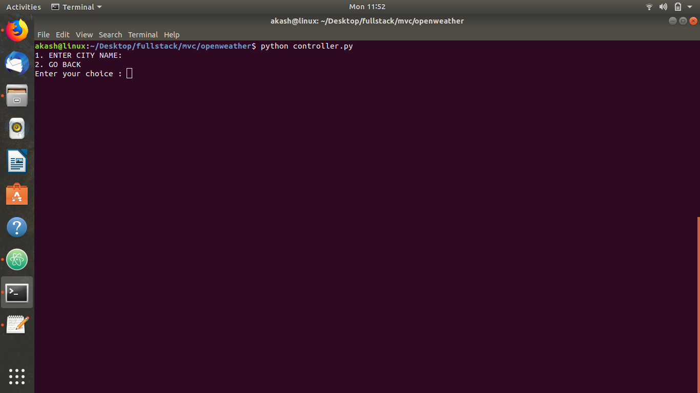
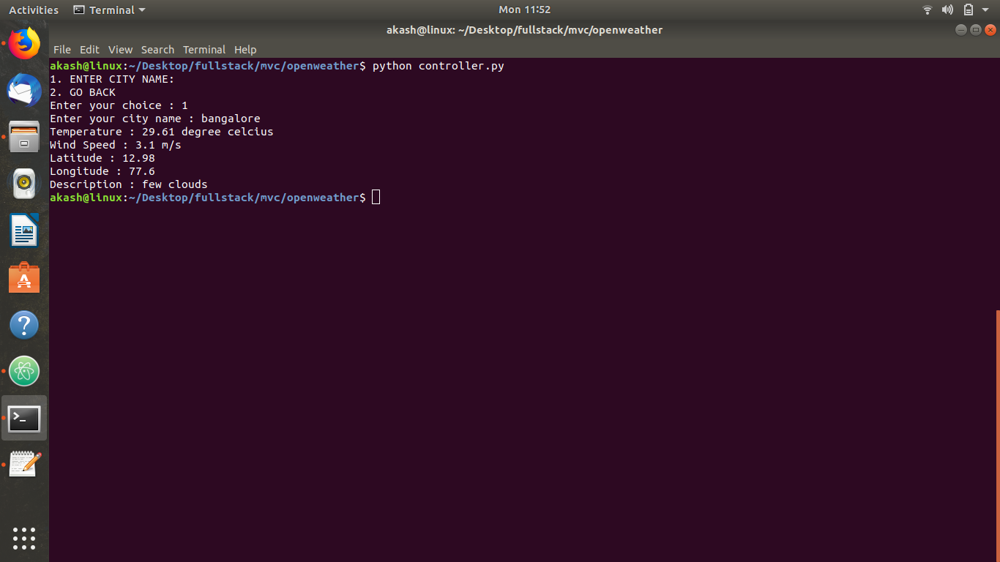

# current_open_weather

**overview**

MVC Using the OpenWeatherMap API Access current weather data for any location on Earth including over 200,000 cities! Current weather is frequently updated based on global models and data from more than 40,000 weather stations,using json api.

## Requirements
* python requirements
    * python 3, request library.

* api
how to get api keys?
  * step 1:- go to https://openweathermap.org 
  * step 2:- Create New Account click on sign up https://home.openweathermap.org/users/sign_up
  * step 3:-you get your unique api key example -b6907d289e10d714a6e88b30761fae22

* how to run this program 
* step 1 : run controller.py file 
  * click   1 OPEN
  * click   2 TO QUIT

* 

* step 2: when you click 1 
  * enter city name example : bangalore
  
* 

* step 3: it will show the weather details of that city

* 
  

